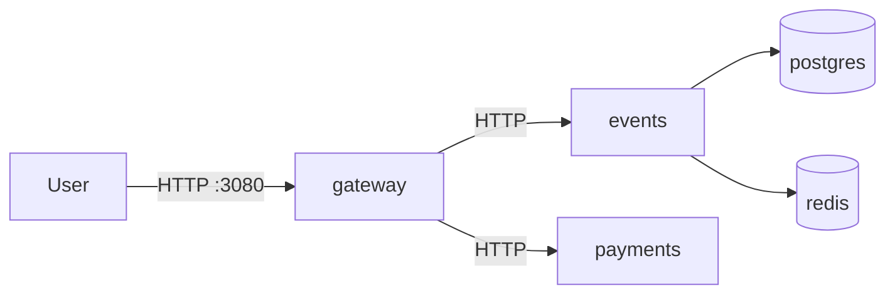

# Lab 1 — SRE Philosophy: Deploy, Break, Understand

## Task 1 — Deploy & Break QuickTicket

### 1. `docker compose ps` (all 5 services)

From `app/`: `docker compose up --build -d` then `docker compose ps`.

Expected: five containers **Up** — `gateway`, `events`, `payments`, `postgres`, `redis`. Gateway published on `0.0.0.0:3080->8080/tcp`. Postgres and redis should be healthy.

```
NAME              IMAGE             STATUS                   PORTS
app-gateway-1     app-gateway       Up                       0.0.0.0:3080->8080/tcp
app-events-1      app-events        Up                       0.0.0.0:8081->8081/tcp
app-payments-1    app-payments      Up                       0.0.0.0:8082->8082/tcp
app-postgres-1    postgres:17-alpine Up (healthy)             0.0.0.0:5432->5432/tcp
app-redis-1       redis:7-alpine     Up (healthy)             0.0.0.0:6379->6379/tcp
```

### 2. Critical path (list → reserve → pay)

Seed event `1` is Go Conference 2026 (100 tickets, 5000 cents).

**List** `GET http://localhost:3080/events`

```json
[
  {
    "id": 1,
    "name": "Go Conference 2026",
    "venue": "Main Hall A",
    "date": "2026-09-15T09:00:00+00:00",
    "total_tickets": 100,
    "price_cents": 5000,
    "available": 100
  },
  {
    "id": 2,
    "name": "SRE Meetup",
    "venue": "Room 204",
    "date": "2026-10-01T18:00:00+00:00",
    "total_tickets": 30,
    "price_cents": 0,
    "available": 30
  },
  {
    "id": 3,
    "name": "Cloud Native Summit",
    "venue": "Expo Center",
    "date": "2026-11-20T10:00:00+00:00",
    "total_tickets": 500,
    "price_cents": 15000,
    "available": 500
  },
  {
    "id": 4,
    "name": "Python Workshop",
    "venue": "Lab 301",
    "date": "2026-09-22T14:00:00+00:00",
    "total_tickets": 25,
    "price_cents": 2000,
    "available": 25
  },
  {
    "id": 5,
    "name": "Kubernetes Deep Dive",
    "venue": "Auditorium B",
    "date": "2026-10-10T10:00:00+00:00",
    "total_tickets": 80,
    "price_cents": 8000,
    "available": 80
  }
]
```

(`available` drops after confirmed orders.)

**Reserve** `POST /events/1/reserve` `{"quantity": 1}`

```json
{
  "reservation_id": "<uuid4>",
  "event_id": 1,
  "quantity": 1,
  "total_cents": 5000,
  "expires_in_seconds": 300
}
```

**Pay** `POST /reserve/<uuid>/pay`

```json
{
  "order_id": "<same-uuid>",
  "event_id": 1,
  "quantity": 1,
  "total_cents": 5000,
  "status": "confirmed"
}
```

### 3. Healthy `/health`

```json
{
  "status": "healthy",
  "checks": {
    "events": "ok",
    "payments": "ok",
    "circuit_payments": "CLOSED"
  }
}
```

HTTP 200 only when **both** `events` and `payments` return HTTP 200. Otherwise 503 `degraded`.

### 4. Dependency map

```
gateway → events → postgres
gateway → events → redis
gateway → payments
pay: gateway → payments /charge → events /reservations/{id}/confirm
```



- List / get event / reserve: gateway → events only (postgres required; redis holds the reservation TTL).
- Pay: gateway → payments, then events confirm (needs redis hold + postgres insert).
- If payments is down: browse + reserve still work; pay fails.
- If events is down: catalog and reserve fail; pay cannot confirm.
- If redis is down: list still works; holds are not stored (or reserve 500 if the client was already connected); pay cannot find the reservation.
- If postgres is down: catalog and reserve fail; pay cannot persist the order.

### 5. Failure table

| Component Killed | Events List | Reserve | Pay | Health Check | User Impact |
|-----------------|-------------|---------|-----|--------------|-------------|
| payments | OK 200 | OK | FAIL (stock: 502 `Payment service unavailable`; after Task 2: 503 `payments_unavailable`) | 503 `degraded`, `payments: down` | Can list and hold tickets; cannot checkout |
| events | FAIL 502 `Events service unavailable` | FAIL 502 | FAIL: charge may succeed then confirm 500 `Payment succeeded but confirmation failed` | 503, `events: down` | Catalog and checkout broken |
| redis | OK (list is Postgres only) | FAIL 500 if events already had a Redis client; OR 200 with no hold if events started with Redis down | FAIL after charge (reservation not in Redis → confirm error) | 503: events `/health` marks redis down so gateway `events` is not `ok` | Browse works; seats not reliably held |
| postgres | FAIL 502/500 | FAIL | FAIL on confirm (500) | 503: events postgres check fails | Catalog gone; payment may still charge |

**Why reserve can still work after killing payments:** `/events/{id}/reserve` only calls events. Payments is unused until `/pay`.

### 6. Load generator (`./app/loadgen/run.sh 5 30`)

Mix: ~70% list, ~20% reserve, ~10% reserve+pay.

Healthy: error rate near **0%** (unless tickets sell out → 409).

Kill payments mid-run: list/reserve keep succeeding; the ~10% pay path fails. Error rate **spikes** (order of ~10% plus any sold-out 409s), then drops after `docker compose start payments`.

```
QuickTicket Load Generator
Target: http://localhost:3080 | RPS: 5 | Duration: 30s
---
[10s] requests=... success=... fail=... error_rate=...%
---
Done. total=... success=... fail=... error_rate=...%
```

After `docker compose stop payments`, `fail` and `error_rate` rise because pay returns 5xx.

---

## Task 2 — Graceful degradation

`httpx.ConnectError` on `/pay` returns **503** with an actionable JSON body. Reserve is unchanged (does not call payments).

### Diff

```diff
diff --git a/app/gateway/main.py b/app/gateway/main.py
--- a/app/gateway/main.py
+++ b/app/gateway/main.py
@@
     except httpx.HTTPStatusError as e:
         raise HTTPException(e.response.status_code, "Payment failed")
+    except httpx.ConnectError:
+        return JSONResponse(
+            status_code=503,
+            content={
+                "error": "payments_unavailable",
+                "message": "Payment service is temporarily down. Your reservation is held — try again in a few minutes.",
+                "reservation_id": reservation_id,
+            },
+        )
     except Exception as e:
         log.error(f"payment error: {e}")
         raise HTTPException(502, "Payment service unavailable")
```

### Verify (`docker compose stop payments`)

Reserve still works:

```json
{
  "reservation_id": "<uuid>",
  "event_id": 1,
  "quantity": 1,
  "total_cents": 5000,
  "expires_in_seconds": 300
}
```

Pay:

```json
{
  "error": "payments_unavailable",
  "message": "Payment service is temporarily down. Your reservation is held — try again in a few minutes.",
  "reservation_id": "<uuid>"
}
```

HTTP **503**. Rebuild gateway after the change: `docker compose up --build -d gateway`.

---

## Task 3 — GitHub Community

Starring a repository bookmarks it on your profile and is a public signal of interest; star counts help others judge popularity and help maintainers get visibility. Following people puts their activity in your feed, which helps you see how classmates and staff work and builds professional connections beyond the course.

- Starred the course repository and https://github.com/simple-container-com/api
- Followed @Cre-eD, @Naghme98, @pierrepicaud
- Follow at least 3 classmates on GitHub (do this in the GitHub UI)

---

## Bonus — Resource usage

Capture with:

```bash
docker stats --no-stream --format "table {{.Name}}\t{{.CPUPerc}}\t{{.MemUsage}}\t{{.NetIO}}\t{{.PIDs}}"
```

| Scenario | What you should see |
|---------|----------------------|
| Idle | Postgres usually highest **memory**; app CPUs near 0% |
| Load (`run.sh 10 30`) | **CPU** rises on **gateway** and **events** (every request hits them); network I/O up on gateway |
| Chaos (`PAYMENT_FAILURE_RATE=0.3 PAYMENT_LATENCY_MS=500`) | Gateway holds connections longer (`GATEWAY_TIMEOUT_MS=5000`); gateway CPU/PIDs/memory stay elevated vs fast payments |

- **Most memory:** typically **postgres** (data + shared buffers); Redis is small; Python services grow a bit under load.
- **Most CPU under load:** **gateway** and **events** — they are on the hot path for list/reserve/pay.
- **Fault injection vs gateway:** 500ms sleep in payments keeps gateway’s httpx client waiting, so more in-flight requests and higher gateway resource use than idle payments.

Restore:

```bash
docker compose stop payments
PAYMENT_FAILURE_RATE=0.0 PAYMENT_LATENCY_MS=0 docker compose up -d payments
```
